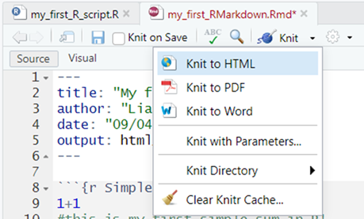

```{r setup, include=FALSE}
knitr::opts_chunk$set(message=FALSE,warning=FALSE, cache=TRUE)
```

```{r extra functions and packages, include=FALSE}

# Function allows coloured text to be added 
colourise <- function(x, color) {
  if (knitr::is_latex_output()) {
    sprintf("\\textcolor{%s}{%s}", color, x)
  } else if (knitr::is_html_output()) {
    sprintf("<span style='color: %s;'>%s</span>", color,
      x)
  } else x
}

# Library to enable emoji use.
library(emo)

```

```{css, echo=FALSE}

/* this chunck of css code enable 'pop-out' boxes to be used */ 

.boxout {
  padding: 1em;
  background: bisque;
  color: black;
  border: 2px solid black;
  border-radius: 5px;
  padding-top: 5px;
  padding-bottom: 5px;
  }
.center {
  text-align: center;
}

.warning {
  padding: 1em;
  background: pink;
  color: black;
  border: 2px solid black;
  border-radius: 5px;
  padding-top: 5px;
  padding-bottom: 5px;
}
.center {
  text-align: center;
}

/* this chunck of css code enables borders around images */ 
.bordered{
  border-style: solid;
}
```
<br>

## 1. What is R and what *are* its advantages?

This workshop will introduce you to a programming language, called R, which is a particularly useful tool to use when you need to handle and organise quantitative data and/or statistically analyse this kind of data.^[In fact, R has many cool applications beyond these two uses. For example, I used it to create this webpage! Data handling and analysis are two areas in which it really excels though.] 

There are several upsides (and a few challenges) associated with learning to use R, which I've summarised in this first section. For a fuller explanation of why R is a useful tool for researchers, especially those who want to do [Open Science/Research](https://support-for-researchers.ed.ac.uk/getting-started/doing-research/open-research) and apply an [Open approach to Analysis](https://doi.org/10.1177/0022219420945267)^[van Dijk et al. (2020) https://doi.org/10.1177/0022219420945267], please refer back to my session on this subject earlier in the week: [link to previous session]().

:::: {.boxout data-latex=""}
::: {.center data-latex=""}
**Top tip/pointer:**
:::
If you have attended the previous session (see link above), feel free to skip the rest of section 1. This will just be a recap of some key points from it.
::::
<br>

### 1.1 The advantages of learning to use R

Many of R’s advantages come from how well it aligns with the increased need for openness within academic research (i.e. the [Open Science](https://www.cos.io/open-science) agenda). The Open Science research movement has its origins in Psychology^[Open Science Collaboration (2015) https://doi.org/10.1126/science.aac4716] but has since expanded to many other disciplines, across both biomedical and social sciences. Whilst the benefits of Open Science are many, the specific value of R within this context is that: 

* **R is open source.** That means it is free for anyone to download and use. As is RStudio, which is the "Development Environment" in which you actually spend most of your time drafting and trialing your R code before running it. 

* **R fully supports reproducibility of your analyses**. Briefly, when using R to analyse data the process involves you creating a ‘script’ file. This Script contains the lines of code you wrote in order to: (1) wrangle the raw data you are working with into an analysable format and then (2) run statistical tests on that tidied data. Many academic journals now ask researchers to publish not just their data alongside their paper but also some form of ‘analysis script’ file too. Providing both data and analysis script files enables full transparency of your workflow. This helps facilitate further research in the future, which may be looking to reproduce or advance on your original work. Providing others access to your Analysis Script is, essentially, what it means to do *Open Analysis*.^[Open Analysis is one of several core tenets within Open Science]  

In combination, these are powerful and important points because it means that **if you use R to carry out your analysis you will be doing so in a way that allows others to easily check, learn from, and reproduce your work.** `r colourise("**This makes it a great Open Science/Research tool.**", "red")` 

### 1.2 The disadvantages of not learning to use R

In contrast, many paid for stats packages are much less well suited to such ‘openness’ because of the more intuitive, but ultimately opaque, interfaces they offer (e.g. drop down menus, drag and drop interfaces). This results in a much less transparent record of the steps you took when doing an analysis, making it harder for others to check, learn from, and/or replicate exactly what you did when analysing your data. 

That brings me to another advantage of R over paid-for packages (e.g. SPSS, STATA, SAS). Because R is open source (AKA *FREE!*), **it’s a tool you can take with you into any future workplace (e.g. after finishing your degree)**. Knowing how to manage data and perform statistical analysis in a paid-for package (e.g. SPSS) is impressive but knowing how to do this in R is potentially *even more* valuable to you in the long run. For example, what if you’re working for an employer that doesn’t already hold a licence for SPSS? Perhaps they’ve already invested in an alternative proprietary stats packages (e.g. STATA, SAS) or simply can’t afford an SPSS license? Indeed, there are many different stats packages out there and not every organisation invests in uses the same one(s). This fact means R is often a **much better tool for collaboration too**. In projects where you want to work across institutions and, especially, with those outside academia, conducting your analysis via an open-source platform like R can be vital. This ensures a 'shared language' is used amongst collaborators, which is accessible to all. ^[For example, back in the early 2000's I learned SPSS as an undergraduate but then found I had to learn an entirely different stats package (STATA) to work effectively with colleagues in a local health service. STATA was the only stats package the health service were willing to pay the license fee for, so I had to fall in line. Nowadays, my colleagues and I all simply use R to work together, or another open source equivalent!]

### 1.3 The challenges involved in learning to use R

Being fair, R does have a steeper learning curve for new users than stats packages that use drop-down menus and graphical user interfaces. The **command line entry method** you have to use to ask R to do things certainly feels less intuitive and more unforgiving to begin with. Think of it as **learning a new language**, in the course of learning about data management and statistics. That means fixing grammar and punctuation errors in your use of this new *programming* language will likely be something 'extra' that slows you down a little more as you learn to ‘run your first analysis’ and get some results to interpret. This need to 'speak R's language' with reasonable fluency does reduce the risk of you from simply FAFO-ing^[Just "F!!king Around and Finding Out!"] your way through deceptively simple 'drag-and-drop' analysis menus to arrive at a set of incorrect results as your output though `r emo::ji("face screaming in fear")` 

An advantage of R, which could also be viewed as a disadvantage (at least initially), is that **the functions you use within R to run certain statistical tests often require you to be more precise in your defining of them**. For example, most methods for running Multi-Level Models in R require you to specify the covariance structure you want applied in the model or they won’t run. In constrast, if you don’t specify the covariance structure in a Multi-level Model in SPSS it will ‘help you out’ by applying its default choice of covariance structure for you (i.e. Variance Components). In the long run, it’s certainly a good thing that R more frequently forces you to make conscious decisions about important features of your models. However, it does again steepen the learning curve as you begin to learn about some, particularly more advanced, statistical methods because you generally need to know *more* about how they work before you can start practicing and learning how to build them in R.

### 1.4 Help in overcoming these challenges

There is a lot of support out there that you can call upon when you get stuck whilst using R too. Because R is open access, a **very vibrant user community** has grown up around it over the past 10-15 years. There are great advice forums and online how-to guides (e.g. [Stack Overflow](https://stackoverflow.com/), [StackExchange](https://stats.stackexchange.com/questions/tagged/r), [R-bloggers](https://www.r-bloggers.com/), [Cookbook for R](https://rc2e.com/), *and many more*). Nine times out of ten, when you get stuck trying to do something in R a quick 'google' of *“how to do X in R?”* will bring up dozens of links to solutions. 

Extending this, **GenAI can even be a helpful, time-saving tool for R-Users too (e.g. helping you debug your code by spotting/explaining errors in it)**. `r colourise("**However**, I would strongly recommend developing your own knowledge and skills in R to a decent level *before* trying to use these GenAI tools to help you cut corners and speed up your coding.** Please see this [blog by John Wilson](https://blogs.ed.ac.uk/teaching-matters/genai-vs-academic-skills-development/) for a more detailed argument for why responsible use of GenAI when learning to code is *really* important and worth your patience and effort!", "red")`

## 2. So, what is the purpose of this workshop?
Think of this workshop as **a 'day 1' introduction to R, that will ensure you have a good grounding in its core features**. It will also cover some foundational principles for how I would recommend you try to work within R. Consquently, **this workshop will help you establish a good ‘workflow’ in R** from the outset, which enables you to then use it efficiently and effectively. 

Thus, you might want to think of this workshop as a 'down-payment', designed with the aim of flattening your future learning curve in R as much as possible. It certainly contains a lot of 'foundational' information (e.g. about good habits to get into when using R) that I wish I had been taught back in 2008, when I first became an R-User!

`r colourise("This workshop is *NOT* going to jump straight into teaching you how to do statistical analyses in R.", "red")` That would be too much to also throw at you in this first workshop. It is a logical 'next step' you could take though (see advice below)...

:::: {.boxout data-latex=""}
::: {.center data-latex=""}
**Extra tips/pointers:**
:::

At the end of this workshop I *will* point to some really good online courses that you can then use to get going with learning how to use R to do all sorts of interesting things though, such as:

-	Tidying up and manipulating new data you’ve collected, wrangling it into a state that is analysable.
-	Visualising your data (e.g. using Graphs, Charts, Tables).
-	Statistically analysing your data, using either Null Hypothesis Significance Testing (NHST) and Bayesian methods.
::::
<br>

## 3. Getting set up with R and RStudio

R is a programming language and on its own can be *VERY* cumbersome to use. You’re not going to get the most out of it this way either (e.g. some of the ‘reproducibility’ advantages discussed in section 1). For that reason, we tend to **use R indirectly through a second software that 'wraps' around it known as a “Integrated Development Environment (IDE)” or "Code Editor".** The specific Code Editor we’re going to use in this role is called **RStudio**. RStudio allows us to more easily play around and test out our code out as we’re building. This software is also a little more user friendly (e.g. there are some drop-down menus `r emo::ji("grinning face with big eyes")`) and it has additional functionality within it that better allows us to generate a record of the steps we’ve gone through to write our code and develop it. 

With that explained, below are instructions on how to download and install R and RStudio onto a computer you have permission to download software onto. 

:::: {.warning data-latex=""}
::: {.center data-latex=""}
**Warnings!**
:::

**If you are on a University owned computer** (e.g. a PC in a computer cluster) this will normally have R and RStudio pre-installed.

- *If it is not pre-installed* then R and R studio should be downloadable via the university's Software Centre app. Full information on that app and how to use it can be found [here](https://information-services.ed.ac.uk/computing/desktop-personal/supported/windows-10/training/software-center).

**If your own computer already has R and/or RStudio installed** then either use the version you already have or uninstall these prior versions before completing the install steps below. 

::::

<br> 
First, we need to **download and set up** `r colourise("**R**","red")`, do so by:

1. Going to the CRAN website, or to give it its full name: the "Comprehensive R Archive Network": https://cran.r-project.org/
2. In the **Download and Install R** window click the link to take you to the version of R you need (i.e. the version specific to the operating system on your computer). If you want to:^[I wrote these instructions whilst downloading R and RStudio onto my personal laptop (a Macbook) as I don’t have admin rights to download onto my work laptop, which already has R and RStudio installed on it.]
    + **Downloading R for macOS**, first check which Apple PC you have. On the top-left of your screen click the Apple logo, click About This Mac, noting what the Processor line says. Then select the appropriate package, based on your machine, from the list to download.
    + **Downloading R for Windows**, then I’d follow their advice to install the ‘base’ package by clicking the link to **install R for the First time**). This will take you to a page where you can download: `r colourise("*Download R-4.4.3 for Windows*","blue")`, which is what I'd do.
3. Once the file has downloaded, go to you downloads folder, open the installer you have just downloaded and follow the instructions to install, while keeping the default options.

Second, we need to **download and set up** `r colourise("**RStudio**","red")`, do so by:

1. Going to the following webpage: https://rstudio.com/products/rstudio/download/
2. `r colourise("*Ignore*","red")` the *Install R* prompt as you scroll down (you've already installed it). 
3. Scroll further down to the **All Installers and Tarball** table and download the version appropriate for your Operating System (e.g. Windows, macOS). 
4. Once the file has downloaded, go to your downloads folder and... 
    + *If on a Mac*: 
        + Double click on the `r colourise("*RStudio-2024.12.1-563.dmg*","blue")` file you just downloaded to unpack it. 
        + In the window that opens up drag the RStudio icon and drop it into the *application folder*.
        + Double click on the applications folder to open it, find RStudio in the list and double click on it to open it up.^[For ease of access I also drag-and-dropped this icon onto the toolbar at the bottom of my desktop so I can access RStudio quickly in the future (i.e. without going back into applications and scrolling down to find it)] 
    + *If on a Windows PC*:
        + If on a Windows PC double click on the `r colourise("*RStudio-2024.12.1-563.exe*","blue")` file you just downloaded and follow the instructions to install, while keeping the default options.

## 4. Setting up your first workflow in R and RStudio

If you’ve followed the instructions all the way through in the previous section ([3. Getting set up with R and RStudio]), or already have RStudio installed on your computer, you should now be able to open this window open on your desktop: 

<div class="bordered">

</div>
<br> 
We’ll explain in a moment how to interpret what you’re looking at in this window. First though we’ll take one more step to **initiate our first `r colourise("project","red")` in R, because within R we use projects to organise our *workflow***. For example, imagine you start a research program that is going to involve a series of studies. For the analysis of the data from these studies you could create one R project and within this project you could have a sub-folder for each study. In these folders you would then keep the data for each study, the script file(s) for analysing each of these datasets and any other relevant metadata.^[It would be fairly straightforward to then upload this Project to online open-access platforms (e.g. like the [OSF](https://osf.io/)) where you may already have pre-registered these studies' hypotheses. When you then get to the stage your work’s been accepted for publication it’s then very easy to make your data and analysis files publicly available via such platforms - and you can pat yourself on the back for doing great Open Research `r emo::ji("party")`] 

### 4.1. Creating your first R Project

To create a new Project in RStudio:

1. In the drop-down menu at the top of RStudio select **File > New Project…**
2. In the New Project Wizard window that pops up select **New Directory**.
3. On the next window, define your project type as a **New Project**.
4. On the next window, in **Directory Name:** give your project a name (e.g. `r colourise("*my_first_R_project*","blue")`). 
5. If you then click on **Create Project**, you’ll find this Project is created as a folder in whatever default location new folders are created in on your computer. You have the option to select where on you would prefer this project to live though (e.g. on your desktop, on your university onedrive). To do this click **Browse… and selecting your preferred location**.

:::: {.boxout data-latex=""}
::: {.center data-latex=""}
**Extra tips/pointers:**
:::

Think *carefully* about where you want your project to be housed, as it will normally also contain an electronic copy of the data from your research. Therefore the location of this project should be in a suitably secure location, which complies with the standards set out when you obtained ethical approval for your research.

For example, the extra data security offered by housing your project on a Univeristy server or cloud based service (e.g. onedrive) may be essential if you are going to be handling sensitive data as part of your project!.
::::
<br> 
You’ll notice that having created your project, the bottom right pane in RStudio has changed. It now indicates that you are now working within this new directory/project on your computer (see image below):

<div class="bordered">

</div>
<br> 
One final step we'll go through, before I explain RStudio’s layout, is to create a file within your new project. Specifically, let’s create an R Script. These as a type of files that I mentioned in section 1, within which we often code/write the instructions for our analyses. That means they’re the specific files we often want to share when we want to do *Open Analysis* and make our workflow publicly available.

### 4.2. Creating your first R Script

To create a new R script: 

1. In the drop-down menu at the top of RStudio select **File > New File > R Script**
2. To give it a unique name and save it within our Project, then:
    + select **File > Save**
    + In the **Save File – Untitled 1 window** give the R Script a suitable name (e.g. `r colourise("*my_first_R_script*","blue")`) and click **save**.
    
Now you’ve set up your workflow RStudio should look like this, with your first R script saved within your first R project `r emo::ji("party")`:

<div class="bordered">

</div>
<br>

## 5. Understanding a typical workflow

You’ll see we now have four panes within the R Studio window. To understand how they interact in a typical workflow let’s focus first on the top left pane first:

### 5.1. The code editor (top left pane)

In the code editor the new, blank script that we have just created is displayed (i.e. `r colourise("my_first_R_script.R","blue")`). Think of this pane literally as a space where you can write *a script*, just as you might if you wanted to rehearse for an important presentation or interview. Essentially, you will end up writing a list of instructions for R, which you will then want to present to them^[Yes, let’s anthropomorphise R and think of them as a person, a somewhat complicated person who is (at times) difficult to speak with but someone who, deep down, is very interested in helping you! ]. If you’ve written your script well, then R will understand what you’re trying to ask it to do in this script, and it will helpfully carry out these actions.

Before we get on to practicing doing that, let's complete our tour of the other panes though...

### 5.2. The console (bottom left pane)

This pane is literally a *window* into the R software program, which RStudio has opened within it. 

RStudio is very aware that it’s primary role is to act as a go-between between you and R. So, within it (as illustrated below) is a space:

- For you to write instructions (i.e. the code editor) 
- For R to receive these instructions and act upon them (i.e. the console)
- A mechanism for passing these instructions along^[If we’re anthropomorphising Rstudio too, you can think of them as a friend to both you and R, who speaks both your languages, to a reasonable degree, and that has sat you and R down around the same table and is trying to help you communicate in a productive manner with each other.], which we’ll explain in a moment.

<div class="bordered">

</div>
<br>

#### 5.2.1. Command R to 'do something'

Let’s illustrate some important features of this workflow by giving R some instructions to act on. 

1. Start by writing the the following, really simple sum `1 + 1` into your R script.
2. The on the far right of the Code Editor press the *Run* button (circled in `r colourise("red", "red")` in the image below). This will pass the instruction written in your script to the R console, for it to carry out. 

<div class="bordered">

</div>
<br> 
This should produce the following output in the console shown below, which shows us that R has heard our instruction, reporting it back to us on the first line (i.e. `> 1+1`) and on the next one it has acted upon it by carrying out this sum for us (i.e. `[1] 2`).

<div class="bordered">

</div>
<br>

#### 5.2.2. Comment on your commands
Now let’s show you how to also write ‘comments’ into your R script. These are lines of code that aren’t passed on to your console when you hit `r colourise("Run", "red")`.  

To make comments in the Script that aren’t passed on to R put a `#` symbol in front of the line they appear on. For example, amend your script so the first line reads `#1+1`, as illustrated below:

<div class="bordered">

</div>
<br> 
`r colourise("**What is different about the console output if you hit Run now? Is the calculation carried out by R in the console?**", "red")`

**No!**

Let's combine what we've learned hear about comments and commands by entering the following two lines of code into the editor:

```{r command_and_comment, results=F}
1+1
# this is my first simple sum in R!
```

Then: 

1. Hold down the left mouse button and highlight both lines of code.
2. Press *Run* one final time.

Below is the output you should then see appear in the console (circled in `r colourise("red", "red")`):
<div class="bordered">

</div>
<br> 

You’ll note the sum has been calculated again (after removal of the # in front of it) but no additional output results from the additional 'comment' line we’ve added. The comment gets passed on to R but because of the # symbol in front of that line R knows to ignore it. In other words, it know you aren’t trying to give it ‘commands’ in the *“hashtagged”* line.

:::: {.boxout data-latex=""}
::: {.center data-latex=""}
**Extra tips/pointers:**
:::

If you hit the Run button without selecting both lines then just the line that your cursor is currently active on will run. Very often, we have multiple lines of code we want to run in one ‘chunk’. To do this we can highlight the section we want to *Run* manually, like we did here. Alternatively, if we want to *Run* all the code within the script: 

1.	Move your cursor back so it is active (flashing) on the first line of your script.
2.	In RStudio’s menu go to **Code > Run Region > Run from Line to End**.
::::

<br> 
Commenting as you go when you write code is an EXTREMELY IMPORTANT activity. There’s a quite famous quote by [Martin Fowler](https://en.wikipedia.org/wiki/Martin_Fowler_(software_engineer)) that illustrates the problems that not making comments regularly creates, which is: 

<center>***“Any fool can write code that a computer can understand. 
<br> 
Good programmers write code that humans can understand.”***</center>

<br>
`r colourise("**Considering the advantages that R has over programs that don't encourage/allowing commenting. Why do you think it would be advisable to comment frequently, and at length, on code that you write whilst performing statistical analysis?**", "red")` 

`r colourise("**My answer:**", "blue")` On a purely selfish level, comments also help **you** structure and plan out the code you need to write and, once it is written, aid **you** in recalling to mind what different bits of code do. This can be particularly useful if it’s been a few days/weeks/months since you last looked at your analysis script and you’re trying to do something complex within it. This all comes back to an issue of Language too. As I mentioned in section 1.3, R needs you to communicate with it in its Language but we also need to provide translation (for ourselves and others) so that this ‘machine language’ is more easily interpretable by humans!

#### 5.2.3. Saving your R Script

Before we move on to look at the remaining two panes we’ll quickly pause to save the code we’ve written in our R Script. The quickest way to do this is to press the diskette symbol in the tool bar of the Code Editor (circled in `r colourise("red","red")` in the figure below):

<div class="bordered">

</div>
<br> 

:::: {.boxout data-latex=""}
::: {.center data-latex=""}
**Extra tips/pointers:**
:::

You’ll notice that as soon as we do this, the name of the Script in the tab above turns **black**. If we wrote more code the name of the Script would turn back to `r colourise("**red**", "red")`, which is a useful reminder that there is work within the script that has not yet been saved!
::::
<br>

### 5.3. The Environment (top right pane)

The panel in the top right defaults to showing you your current R “environment”. This should be empty at the moment because we haven’t put anything in our project’s environment yet. Often one of the first things we’ll do when starting work on a project though is to load data into the environment that we want to work with in some way.

Let’s have a go at doing that now by following these steps:

1. First, we need to put some data in our project folder that we can then load into our R Environment. To do this, download the `r colourise("*ExampleSDQ_data.csv*","blue")` dataset from [here](https://github.com/Liam-JB-Hill/Intro-to-R-DSS-workshop/blob/73d856dd76feed4c6e226649109fcbb870ce3cab/workshop_data/ExampleSDQ_data.csv), and place it in the *my_first_R_project** directory that you created earlier 

- *Note 1:* On the webpage you're taken to, click on the radio button with three dots on it in the top right hand corner of your screen, the first option on the drop-down menu that appears will be to download this datafile. 
- *Note 2:* I created my project on my desktop, so I just dropped the file in its 'folder' there.

If you’ve done this correctly the file should now be listed in R Studio in the bottom left pane (as per the screenshot below (added dataset circled in `r colourise("red","red")`):

<div class="bordered">

</div>
<br> 

2. Having put some data in our project directory/folder we can now import it into our environment by adding the following line of code to our script and running it:

```{r first_dataset, results=FALSE}
my_first_dataset <- read.csv("ExampleSDQ_data.csv", header = T)
```

This line instructs R to create an object called `r colourise("*my_first_dataset*","blue")` in your environment (*reminder*: top right pane in RStudio), which contains the data from this file. There are many different types of objects that we can place or create in our environment and we’ll discuss a few of these different types in a bit more detail later. For now though you can at least see that there is something in our environment that wasn’t there before (circled in `r colourise("red","red")` in the image below):

<div class="bordered">

</div>
<br> 

:::: {.boxout data-latex=""}
::: {.center data-latex=""}
**Extra tips/pointers:**
:::

Certain objects, like the one we’ve just created, which is called dataframe, can be viewed and explored in more detail by clicking on them in the Environment pane. This will open them up as a tab in the Code Editor pane. For example, if you do that with the `r colourise("*my_first_dataset*", "blue")` object the tab that opens contains a view of the data contained in this dataset. 

Also, before we move on, here’s a few tips on the rules for naming “objects” in R:

- Objects’ names can’t begin with a number (e.g. 0, 1, etc…) 
- Objects’ names can’t contain symbols that denote other operations in R or mathematical functions (for example: +, $, @, !, ^, -, / or *)
- Object names are case sensitive, so be careful what you capitalise!
- Functions (which we talk about later) have their own names and it is not a good idea to use the same name for an object as you do for a pre-existing function, confusion will ensue `r emo::ji("confounded")`

::::
<br>
Below, you’ll see an extended illustration of the workflow that we started to sketch out earlier. You’ll see that we have added a few extra paths through the workspace RStudio lays out for you. Whilst everything is still being controlled by what we write in the Code Editor, this illustration shows how we often use the editor to instruct R to do things that result in it interacting with the environment and the project spaces, as well as the console. For example, we often ask R to:

- Fetch things (e.g. datasets) from external directories in our R project (which can be viewed in the bottom right pane) and put them the internal environment of our R project (which is depicted in top right pane), defining them as “objects” in the environment. 
- Once we have objects in our environment, we can instruct R to carry out operations on the data it now has access to (e.g. we can instruct it to carry certain analyses we want run on these datasets).

**This part of the workshop has hopefully given you a good overview of what you’re looking at when you now open up RStudio and the basic ‘mechanics’ of the R workflow, as laid out within RStudio.** 

<div class="bordered">

</div>
<br> 

## 6. Function and Packages: essential tools

At this point R might not seem the most powerful tool because, so far, you’ve only seen used it as a glorified calculator and data viewer. Now though, **we’re now going to look at some features which can be used within the R workflow that really make it stand out from the crowd**! We’ve actually already used one of these features, to upload our dataset into the environment…

### 6.1. Functions

Functions are a very powerful feature of R, they are basically pre-packaged commands for performing more complex actions on your data within R. A function is denoted by their name followed by a bracket, within which a series of “arguments” are specified and separated by commas. As so:

```{r function_syntax, eval=FALSE}
function (argument1, argument2, etc...)
```

The function we used in the previous section ([5.3. The Environment (top right pane)]) was called `read.csv`. It is a specific function that performs the operation of importing a dataset of a certain type into R ( `.csv` type files, to be specific ). You may recall this line:

```{r first_dataset_repeat, eval=FALSE}
my_first_dataset <- read.csv("ExampleSDQ_data.csv", header = T)
```

To explain what it did in more detail:

1.	The `[name] <- [command]` layout of this code tells R that you are commanding it to create an object. The name of the object appears on the left of the `<-` symbol (i.e. `my_first_dataset`). The commands that instruct R tell as to how the object is defined are then given to the right. 
2.	In this case, the commands that define the object uses the function called `read.csv` to create a dataframe in your environment that contains the data from the file you added to your Project folder. 
3.	Within this specific function, the first argument `“ExampleSDQ_data.csv”` tells R the name of the specific file it needs to fetch from your project. The second argument `header = T` is important too. It tells R something about how the data is laid out within the file, but we’ll learn what exactly that does in more detail a minute.

:::: {.boxout data-latex=""}
::: {.center data-latex=""}
**Extra tips/pointers:**
:::

One nice thing to notice about this approach to using data is that it means the original data file, which is still in your folder remains ‘untouched’. You pull data into the R environment and can edit and play around with this “object” as much as you want but this is completely separate from the original datafile. 

Providing you maintain good version control and comment on it regularly, your script will have a record of all that ‘playing around’ too, which means you should pretty much always have a nice ‘paper trial’ from the raw data up to the ‘cleaned and tidied’ dataset you then usually end up analysing. 

This is less easy to do in some other stats packages, where you work directly with the original data nad often overwrite or change that files in ways can make it hard to retrace your steps back and start again, should you ever need to. 

::::
<br>
**The strength of R is in its functions** because when you become more skilled you can write your own functions to do complicated (but necessary) things to your data. These then become easily reproducible once you’ve written them as functions. For example, behind the simple `read.csv` command you just used may lie hundreds of lines of code that get it to work, but all you needed to do to get it to run was input a couple of instructions (i.e. the arguments) within this nicely packaged function's parentheses! 

Also, **because R is open source other researchers are writing new functions (and refining olds ones so they work better) all the time**. This is why “googling as you go” is a common practice when working in R. There’s always new functionality to find that can make your life easier or greatly improve your code’s efficiency or effectiveness. 

:::: {.boxout data-latex=""}
::: {.center data-latex=""}
**Extra tips/pointers:**
:::

This is an area where R tends to have the edge over proprietary packages too (e.g. SPSS, STATA, SAS). This is because **it is not only a powerful statistical software but also a thriving community of developers who, as you read this, are pushing the boundaries of what you can do with R**, developing new functions and publishing them as open source materials for us to use in our future analyses.  

For example, packages for doing advanced Bayesian Modelling were available in R for almost a decade prior to SPSS getting around to introducing some, very limited, functions for calculating Bayes Factors, for certain types of analyses in mid-2017. 
::::
<br>

### 6.2. The Help function

The idea of learning lots of new function’s names and their arguments might seem daunting. After all, these are akin to learning new words and syntaxes in a new language. You’ll quickly find that you can make good progress in “making yourself understood” by learning a few common functions you’ll use very frequently though (e.g. `read.csv` whenever you want to load a new .csv file dataset into your environment).  

One of the more frequently used and important functions you’ll get familiar with is `help` function, or more precisely: `help()`. Enter the name of any function between help’s bracket and run this request in the console and, in the bottom right hand pane of RStudio, an explanation of the function you need ‘help’ understanding will pop up!

To find out more about the `read.csv` function run a help request on it by entering the following command and running it:

```{r, help practice, eval=FALSE}
help("read.csv")
```

Read the Description in the R Documentation page that pops up in the bottom right pane. Also, scroll down to the **Arguments** list within it and find the entry for the `header` argument. Here you will learn what this argument does when it is set to equal `TRUE`, as was the case in your code.

:::: {.boxout data-latex=""}
::: {.center data-latex=""}
**Extra tips/pointers:**
:::

**These are some extra things you can view in the bottom right pane.**

Given we’ve briefly had our attention drawn to the bottom right pane for the first time, we’ll take an opportunity to highlight what a few of the other tabs within this area allow us to do/see:

-	**Files**, will show you your R project area. There’s quick-button options to add additional folders, rename files etc… here too.
-	**Plots/Viewer**, is where visualisations of your data will appear when you request them (e.g. graphs, charts etc…). Once you’ve created them there’s also a button you can click on here to export them in a variety of file-types. 
- **Packages**, contains a list of all the R packages you have loaded on your computer. **What are R packages you might ask? Well, that’s something we’re about to talk about… `r emo::ji("smirking face")`** 
::::
<br>

### 6.3. Adding Packages (to add new *Functions*)

The ***"Functions"*** that are at the heart of R’s amazing flexibility are **stored in folders known as “Packages”**. There are literally thousands of add-on Packages now available in R that allow you to do all sorts of new and exciting things (e.g. new packages for doing different types of analyses that are growing in popularity )^[e.g. the `brms` package for doing Bayesian modelling, the `lme4` package for doing multi-level modelling, the `lavaan` package for doing structural equation modelling, the `wrs2` packed for robust methods (i.e. a lot of functionality that you can’t get to the same degree in SPSS)! `r emo::ji("star-struck")`]. More packages are being created all the time too, which build exponentially on R's base functionality.

Within the last decade several packages have come along that contain families of functions that have really enhanced the usability of R and expanded its user base. In particular, there are packages created by [Hadley Wickham](https://hadley.nz/) (e.g. `tidyr`, `dplyr`, collectively referred to as part of the `tidyverse` of R packages) that have made some of the conventions of programming in R a bit more user-friendly, and thus intuitive for new learners to get to grips with.  

To illustrate the process of adding new packages to your R environment we’re going show you how to add some of these `tidyverse` packages, which some of my past students have found very useful packages to learn as they started out with using R.

#### 6.3.1. Installing new Packages

The first step when accessing new packages is to download them to your computer. You can do this in RStudio using the `install.packages()` function. First, we’ll create an object that is a list of the names of five packages we want to add, called `pkg`. Then, we’ll use the `install.packages()` function to download this list of packages from an online repository.

To complete these steps write the following code in your script and run it in the console: 

```{r download_tidyverse, eval=FALSE}
# list of useful packages
pkg <- c ("tidyr", "dplyr", "ggplot2", "knitr", "rmarkdown")

# install them, downloading them from the CRAN repository
install.packages(pkg, repos = "http://cran.rstudio.com")
```

Your computer should happily whirr away for a minute or two downloading these packages. 

#### 6.3.2. Loading new packages (after installing)

Like datasets in your project directory/folder, the functions in the packages we just installed packages **are not** immediately available for you to now call upon in your environment. Instead, whenever you start a project that needs to use functions from certain package you need to load these packages into the project’s R environment (i.e. top right pane, discussed in section 5.3). We do this by loading them as *“libraries”*. To do this for the five packages you’ve just installed, write the following code in your script and run it in the console:

```{r tidyverse_libraries, eval=FALSE}
# load the five packages that we just installed into your project's environment
library(tidyr)
library(dplyr)
library(ggplot2)
library(knitr)
library(rmarkdown)
```

In fact, it is not uncommon for the first few lines of any R script to simply contain a list of lines like this, which ‘load up’ all the libraries of functions needed to make the subsequent commands in the script run in the R environment. 

:::: {.boxout data-latex=""}
::: {.center data-latex=""}
**Extra tips/pointers:**
:::

Alternatively, **there’s a simple drop-down menu option you can use within R to search for and then download new packages**. To use this:

1. In the toolbar go to: **Tools > Install Packages…**
2. You shouldn’t need to change the **Install from:** option if you’re downloading a package from the CRAN repository (as we did) but if you’re adding a package that you’ve previously downloaded to your computer (e.g. as a .zip file) there’s an option to indicate this here (i.e. *Package Archive File (.zip; .tar.gz)*).
3. You can then search for the name of the package you’re wanting to download in the **Packages (separate multiple with space or comma):** field. This has a nice auto-complete function in this field too. 
4. In **Install to Library:** decide where you want the package to be downloaded to on the computer. *Note:* I rarely (if ever) play around with the default here. 
5. Normally, ensure **Install dependencies** is ticked. this automatically downloads any additional packages that you might need to run within the package you're wanting to download, in order to get it to work.
6. Then click **Install**.
::::
<br>

## 7. Introducing RMarkdown

**RMarkdown files** are a very versatile R file-type that has a few advantages over more 'traditional' R scripts. In fact, I like to think of them as a more sophisticated version of the Scripts that we’ve already been worked with (see section [4.2. Creating your first R Script]). 

Like Scripts, RMarkdown files they typically contain sections of R code, which are bookended by ‘comments’ around them that explain the intended functionality of the code and characteristics of the data that is being worked on.

However, **a particular advantage RMarkdown files have over R Scripts is that they can be used to output a number of documents (e.g. HTML webpages, PDFs or Word files)** that report the code and its output, which can be read outside of R. Consequently, RMarkdown files are what you’ll spend a lot of your time working with if you are prepping code to share publicly. Equally, they’ll be what you spend a lot of time looking at if you are viewing other people’s published analyses or working through online tutorials to up-skill further in R.^[A lot of online tutorials are created published using RMarkdown. Like this one! `r emo::ji("beaming face with smiling eyes")`]

We’re going to create our own RMarkdown file and use it to output an MS Word document that is a summary of the content of the `r colourise("*my_first_R_script.R*", "blue")` we created earlier. By going through the steps to do this, we will demonstrate some of the additional key features that are available within RMarkdown. These will help you format and produce more openly-accessible versions of your code. 

### 7.1. Creating your first RMarkdown file

To create your first RMarkdown file:

1. In the drop-down menu at the top of RStudio select **File > New File > R Markdown…**
2. In the **new R Markdown** window that opens give your file a **Title** (e.g. my first RMarkdown) and add yourself as the **Author**.
3. To save it:
    - Go to select **File > Save as**
    - In the **Save File – Untitled 1 window** give the file the same name that reflects the Title you gave it in step 2 (e.g. `r colourise("*my_first_RMarkdown*", "blue")` and click **save**.

### 7.2. Exploring and editing the RMarkdown file

Your new RMarkdown file will now have appeared in the code editor. At the top of it are the details you specified in setting it up (i.e. it’s title, author etc…). Scrolling down you’ll see it already includes some ‘template’ text which gives instructions and suggestions on how to lay out the file. 

When you get familiar with using RMarkdown files you’ll probably just delete these pointers and get on with drafting your own work. For now though, they give you some good illustrations of the structure of a markdown file. Over the final few sections of this workshop we’ll edit these sections, to demonstrate some key points about how the RMarkdown files work and are laid out. For now though, let's have a look at them. 

*Note:* the numbering of these section in the image below correspond to the numberin sub-sections that follow here. 

<div class="bordered">

</div>
<br>

#### 7.2.1. the Header

This section will appear at the top of the Word document your markdown will later output. It contains all the pertinent metadata associated with your file (e.g. who wrote it, when it was created). There’s nothing we need to change here so we’ll move on.

#### 7.2.2. Chunks of R code

This is an example of a chunk of R code that will be embedded in the document your Rmarkdown file outputs. **Chunks of code are 'marked out' by having a grey background in the markdown file**. This helps distinguish them from white sections of ‘plain text’ that appear around them, which typically provides supporting commentary and explanation for the code chunks. 

Sections of code are bookended by three “backticks” (i.e. ` ``` ` ) and on the first line of a code chunk there’s a bracketed section that has to begin `{r` and ends with another closing `}`. You can insert a name for this section after the r in this bracket, which won’t appear in the outputted file. In this example chunk its name is `setup`. After the name you can insert a further argument (after a comma) that gives some instructions as to how you want the code chunk to be handled in the outputted file. I will call this the **Header line** for a code chunk.

The `include=FALSE` argument used in the Header line tells R not to include either the code or its output in the resulting document.^[R will run the code but its output will be ‘hidden’, not appearing, in the final outputted document.] Let’s make some changes to the Header line so it reflects what we did in our first R script, back in section [5.2.1. Command R to ‘do something’].

Specifically:

- Change the name of this chunk to: `Simple Sum`
- Change the argument for how you want it handled from `include=FALSE` to `eval=TRUE`. This instruction will mean that the code you put in this chunk will be displayed in the outputted Word Document as well as its output. 
- Remove line 9^[the one that reads `knitr::opts_chunk$set(echo = TRUE)`]  and replace with the first two lines from your `r colourise("*my_first_R_script.R*","blue")` file (i.e. the lines with the sum and the comment that follows it, illustrated back in section [5.2.2. Comment on your commands]).  

#### 7.2.3. Plain text (i.e. not 'R code')

This section gives an example of some plain text that would appear in the document your RMarkdown file outputs. At the moment this exemplar text gives you a link to more details on RMarkdown files and some instructions on what the ‘Knit’ button in the toolbar helps you do. *Note:* We’ll get to knitting later, don’t worry about that for now though! 

This section (from lines 12 to 16) can be thought of as being equivalent to the # marked ‘comments’ we made in our original R Script. In other words, they are what we’ll use to provide context and explanations in support of our chunks of R code.

Typically, in this ‘metadata’ we want to use formatting (as we would in a text file) to: 

1. Structure what we want to say under headings and into paragraphs.
2. Provide emphasis on certain points or words
3. Insert hyperlinks to other resources or references. 

We can set this all up here using a bit of simple formatting. Let’s do this by overwriting the default text with the following:

##### 7.2.3.1. Headings

Starting with **Headings**, in an RMarkdown file the # symbol means something different from when it is used in an R Script. A # in front of a line of plain text indicates it should be formatted as a Heading. You can nest sub-headings within headings too, by double (i.e. ## ) or triple (i.e. ###) hashing sub-headings and sub-sub headings, respectively. 

To try this out, replace the `r colourise("##R Markdown","blue")` line (line 12) with the following text. This sets out a structure for one main heading and two sub-headings beneath it:

```{r headings, eval=FALSE}
# Setting up my project

## Uploading my data

## Extra formatting tips
```

##### 7.2.3.2. Paragraphs

Breaking up text within these new sections into **paragraphs** is obviously important for structuring what you want to say too. Under the first subheading write as following: 

```{r now paragraphs, eval=FALSE}
# Setting up my project

## Uploading my data

This is how you upload a dataset. 

It is really easy!

## Extra formatting tips
```

You need to **put an `r colourise("empty line","red")`^[This is sometimes referred to as a ’line break’] between each paragraph and between the last paragraph and the next heading**. That space informs R that these need formatted as separate paragraphs. If you don’t leave a line between each paragraph in R the text will all run them together into one big, messy, block. `r emo::ji("confounded")` 

##### 7.2.3.3. Emphasis

**Emphasis** can also be placed on particular words and phrases. One example of this would be to **put certain words in bold**. To give the instruction to place certain words/phrases in bold within an RMarkdown file you need to bookend them with a double asterisk either side, as illustrated for the fourth line in the example below:

```{r now emphasis, eval=FALSE}
# Setting up my project

## Uploading my data

This is how you upload a dataset. 

**It is really easy!**

## Extra formatting tips
```
<br>

:::: {.boxout data-latex=""}
::: {.center data-latex=""}
**Extra tips/pointers:**
:::
Lots of other types of formatting, besides simply adding Headings and putting things in Bold, are available in RMarkdown but I’ll leave you to discover further formatting tricks, should you wish to learn them, at another time. 

There’s a really good tutorial that goes into the further, formatting related, things you can do in RMarkdown that has been written by Chester Ismay, which can be founnd online here: 

(https://ismayc.github.io/rbasics-book/4-rmarkdown.html#the-components-of-an-r-markdown-file) 

In it they explains how to italicise plain text, strikethrough statements, add horizontal rules, insert quotations, equations, bullet-points and numbered lists and more!
::::
<br>

##### 7.2.3.4. Inserting Links

Lastly, we can **insert links** into our plain text. This is handy when we want to provide external links to papers we’ve referenced or want to direct people to open access webpages where our publications or data are available. Hyperlinks can be created by putting the word we want to work as the clickable link in square brackets `[click here ]` and then putting the link within round brackets directly after this `(to go here)`. Let’s do this under the second subheading by entering:

```{r now hyperlinks, eval=FALSE}
# Setting up my project

## Uploading my data

This is how you upload a dataset. 

**It is really easy!**

## Extra formatting tips
  
This page by Chester Ismay has lots more useful advice. See [here](https://ismayc.github.io/rbasics-book/4-rmarkdown.html)  
```

#### 7.2.4. Adding and Removing chunks of R code

This section of the Rmarkdown file gives an example chunk of R code, which has been entitled `cars` in its Header line. You’ll note that there’s not another argument after this chunk's name in the bracket (unlike in section 7.2.2)^[e.g. where there was a further argument of `include = FALSE` or `eval = TRUE`]. This would result in the code you put in this chunk being displayed in the outputted Word Document as well as its output. In other words RMarkdown presumes that the default for any chunk of R code is `eval = TRUE`.^[So did we need to specify `eval = TRUE` for the previous chunk in section [7.2.2. Chunks of R code]? `r emo::ji("thinking")` No, R would have defaulted to doing this anyway. It did gave us an opportunity to discuss what this argument does though, and an opportunity to show you how to edit it]. *Note:* the `eval =` argument's function within a code chunk's Header line was already discussed in section [7.2.2. Chunks of R code]. 

In our Markdown file **we don’t need this chunk of R code though. So, simply highlight these three lines and press Delete them**. 

**Instead**, let’s add a couple of chunks of R code underneath the “Uploading my data” sub-heading, as illustrated below:

<div class="bordered">

</div>
<br>
You can just type these new lines out or:

- Click on the **Insert** button in the toolbar for the RMarkdown file (circled in `r colourise("red", "red")` above).
-	In the drop-down menu that appears **select R**, below this option you’ll see there are further options to insert code chunks from other programming languages too. 
-	**Repeat this process to create two code chunks**: one that spans lines 18-20 and one that spans lines 22-24, as shown in the figure above.
- Into both chunks insert the line of R code that created the `r colourise("*my_first_dataset*","blue")` object in your project’s environment, from the `r colourise("ExampleSDQ_data.csv","blue")` file earlier (see section [5.3. The Environment (top right pane)]).

To finish up, let's play around with how these two chunks will be treated in the final output. Do this by updating the code in the Header lines of the respective chunks as follows:

1. **In the first chunk**, update the `{r}` bracket so it reads `{r show_dont_do, eval = FALSE}`. The `eval = FALSE` argument here will mean that this chunk of R code will be displayed but it won’t be run (AKA *evaluated*) in the R console . This can be useful when you want to show a bit of code in your final document but don’t actually want it to be run. *Scenarios where this might be useful are if:*
    - In writing a document for teaching purposes, you want to demonstrate a common coding error. 
    - Sometimes there are multiple versions of your analysis code that you want to present to aid a reader's understanding (e.g. explaining earlier iterations of a model you refined over several steps). However, whilst you may want to show all this code, you might also only want to ‘run’ the code for the final model, so only its results appear in the final document.
2. **In the second chunk**, update the `{r}` bracket so it reads `{r dont_show_but_do, include = FALSE}`. The `include = FALSE` argument means the code will run (i.e. the object `r colourise("*my_first_dataset*","blue")` will be created) but neither this chunk or the output will appear in the document created by this RMarkdown. *Scenarios where this might be useful are if:*
    - When you want some code to be run *in the background* to help create the document, which the reader does not need to be aware of. For example, importing a dataset into your environment from a local directory on your computer that an external reader will have to obtain by other means.^[For example, they may need to instead download your data from an online open access repository] 

:::: {.boxout data-latex=""}
::: {.center data-latex=""}
**Extra tips/pointers:**
:::
The different ways we’ve set up the Header lines in these two chunks has illustrated nicely the flexibility we have to turn “on” and “off” chunks of code, and even having them run in the background. 

In terms of what we’re trying to do in these chunks though (i.e. simply uploading our dataset into the environment), the use of two chunks is overcomplicating things. 

The most efficient choice here would be just one chunk, with `eval=TRUE` probably being the most appropriate argument to include in its Header line, to instruct R on how you want it handled.
::::
<br>

#### 7.2.5. Including output without its code

There’s one last option we can apply to handling chunks of R code which we haven’t covered yet. This is shown in section 7.2.5. of the template Rmarkdown file. In this section the code chunk creates a plot and will include this plot in the document created *but without also including a copy of the R code chunk that created it!*
<br>

It’s not unusual, when creating visualisations (e.g. graphs) in R, to want the final document to simple show the graph itself but not the 'underlying' lines of code we used to create it. Often, these are unnecessary clutter. To run an R code chunk and display its output but hide the chunk itself we use the argument `echo = FALSE` in the Header line for the chunk. That’s the case in this code chunk here, circled in `r colourise("red","red")`. 

<div class="bordered">

</div>
<br>
*Note:* In the above code we've also amended the code chunk in the template so that it presents data from the SDQ dataset we imported earlier. 

There are two arguments that need inputs in the *plot()* function here, separated by a comma `,`. These indicate the data you want placed on the X and Y axis of this plot. 
- The **first argument** (`my_first_dataset$Age_Years`) tells R the variable you want presented on the **x-axis of this plot**. This variables name includes the name of the variable `Age_Years` *and* a prefix that tells R which dataframe (`my_first_dataset`) it can be found in, with these two bits of information linked by a `$` sign.^[It might seem obvious right now that this variables is within this dataframe because that is the only dataset we have uploaded to the R environment. However, when you got further on in your work in R it is very possible you will have multiple dataframes in use simultaneously. Thus R requires us, from the outset, to prefix each variable’s name with the name of the dataframe if comes from, so what we’re asking for is always clear. ]
- The **second argument** (`my_first_dataset$TDS`) tells R the variable you want presented on the **y-axis** of this plot. *Note:* TDS stands for "Total Difficulties Score" and is a continuous score (out of 20) calculated from response to a questionnaire.  

:::: {.boxout data-latex=""}
::: {.center data-latex=""}
**Extra tips/pointers:**
:::
`plot()` is actually a pretty basic graphing function. It has allowed us to illustrate a point here but one of R’s advantages is the really flexible visualisation packages you can use within it. One, called `ggplot2` is extremely popular and is part of the `tidyverse` family of packages we mentioned (see section [6.3.1. Installing new Packages]). There’s a really good online tutorial on how to get started with `ggplot2` that I’ll point out to you at the end of this workshop, if you’re interested in learning more about it. 
::::
<br>

#### 7.2.6. In-lining R code in the plain text

The last section of the RMarkdown template file (7.2.6) gives an illustration of how you can ‘in-line’ R code into the plain text sections of your documents. This can be handy when you want to quote/refer to parts of your code in the surrounding comments. You'll have seen me do it several times already in this material!

Using RMarkdown you can quote code in your writing (in the font/format it displays in RStudio) by putting it in back-quotes ` `code here` `.^[What’s a back-quote look like? It’s like a ‘small apostrophe’. On a regular QWERTY keyboard you’ll usually find it just above the shift key and to the left of the 1.]. In the template example, back-quotes have been use to pick out `echo = FALSE` as a bit of R code appearing within the plain text of your Markdown file. To practice doing this yourself, edit this section so it reads:

<div class="bordered">

</div>
<br>
In this section the inline function is used in an explanation of R’s `help()` function. Then, in the second paragraph, you’ve also shown how you can use inlined code to run certain calculations in the plain text. That’s not apparent here but it will be when we "knit" this into our final output document, which is what we’ll do next!`r emo::ji("beaming face with smiling eyes")`

### 7.3. Knitting the RMarkdown file into an HTML or Word doc

In RMarkdown the creation of a document from the markdown file (e.g. as a .html, .docx or .pdf file) is referred to as ‘knitting’ it together.^[A charmingly eccentric term, if you ask me! `r emo::ji("knit")`]. My advice would be to first create your document as a .html file (i.e. webpage) because this will automatically create a preview of it in the viewer panel in the bottom right hand pane of RStudio, if you follow the steps below:

1. First, **click on the Cog symbol** in the toolbar of your RMarkdown file and **in the drop down menu ensure the Preview in Viewer Pane option is selected**. See illustration below:
<div class="bordered">

</div>
<br>
2. Next, **click on the downward pointing triangle next to the word Knit** in the toolbar, and in this drop-down menu **select Knit to HTML**. See illustration below:
<div class="bordered">

</div>
<br>

3. The console should whirr away for a moment, knitting together your html file from the instructions in your RMarkdown file and when it finishes you will **see a preview of this .HTML version of the final document in the Viewer tab in the bottom right hand pane**, which you can scroll down through. See illustration below:
<div class="bordered">

</div>
<br>

4. Scroll down through it and see if everything is formatted as you would expect it to. If you switch to the Files tab (circled in `r colourise("red","red")` in the previous image) you will also see that several new files have been added to your R Project’s folder, most importantly, you'll see an icon for the `r colourise("my_first_RMarkdown.html","blue")` file that you were just previewing in the viewer. This is circled in `r colourise("red","red")` in the image below. 

<div class="bordered">

</div>
<br>

5. If you’d like to see how it would display in a web browser you, just click on this file and **select the View in Browser option** and it’ll open up in your web browser. 
6. **If you spot any errors** or just want to play around with the formatting or layout some more, simply **make the changes necessary to the RMarkdown file** in the code editor and **then repeat your ‘knitting’ the document**. This will update the html file, applying any further edits you’ve made to it. 
7. Lastly, **to output an RMarkdown file as a Word document instead**, repeat steps 1 and 2 but when you get to the drop-down menu in the second step select **Knit to Word** instead. **This will create a `r colourise("my_first_RMarkdown.docx","blue")` file in your project directory**, which should auto-open on your desktop. See illustration of this new file, highlighted in `r colourise("red","red")`, in the image below. If it doesn’t auto-open then you can click on it in your Project directory and it should open in Word, allowing you to go in and inspect how it’s been laid out.

<div class="bordered">

</div>
<br>

This brings us to the end of our beginners tour through the R environment and its workflow. 

At this point, take a moment to reflect on all that you've learned. I'm hopeful that you'll feel you now have a clearer understanding of the mechanics of how R works. Not a perfect understanding yet but you're definitely on your way! `r emo::ji("beaming face with smiling eyes")` 

**For example, after only a few hours you now know how to:** 

**1. Set up your own projects in R.**
**2. Carry out some activities within these project using R (e.g. importing data, plotting it).**
**3. Publish the results of these activities in a format you could then share with others!**  